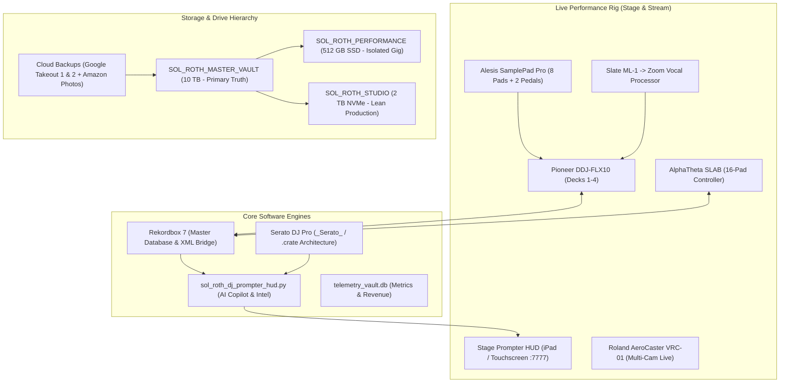

# DJ SOL ROTH: MASTER SYSTEM ARCHITECTURE & PERFORMANCE OPERATIONS MANUAL
### "BASS MUSIC WITH LIVE HANDS" — HARDWARE, SOFTWARE, TELEMETRY & STORAGE SPECIFICATION
**Version:** 3.0 (Consolidated & Master Vault Verified)  
**Last Updated:** September 2026  
**Master Drive:** `/Volumes/SOL_ROTH_MASTER_VAULT`  
**Studio Drive:** `/Volumes/SOL_ROTH_STUDIO`  
**Live Performance Drive:** `/Volumes/SOL_ROTH_PERFORMANCE`  
**Central Repository:** `axiom01` ([GitHub](https://github.com/Sol-Roth-Media/axiom01) | [Live Docs](https://sol-roth-media.github.io/axiom01/))

---

## 1. Executive System Overview

DJ Sol Roth is an end-to-end performance hybrid DJ, electronic music producer, turntablist, filmmaker, and author. The technical ecosystem bridges physical instruments, dual software DJ platforms (Rekordbox 7 & Serato DJ Pro), custom telemetry HUD displays, and a multi-tiered storage architecture.



---

## 2. Music Library Architecture & Rekordbox Integration

### A. Library Inventory & Physical Disk Layout
* **Master Vault Root:** `/Volumes/SOL_ROTH_MASTER_VAULT/01_DJ_AND_PERFORMANCE/ALL DJ Music/`
* **Convenience Symlink:** `/Volumes/SOL_ROTH_MASTER_VAULT/ALL DJ Music`
* **Total Physical Tracks on Disk:** **3,911 audio tracks** (Stereo 320kbps MP3 and 24-bit 44.1kHz WAV).
* **Rekordbox Analyzed Collection:** **4,305 analyzed tracks** with pre-calculated waveforms, BPM grids, and hot cues.
* **Directory Organization:**
  * Alphabetical Folders: `0-9`, `A` through `Z` (27 clean sorting partitions).
  * Performance Specialized Bins:
    * `BPM Transitions/` — Tempo shift weapons (e.g. 128 to 140 BPM, 130 to 150 BPM).
    * `DJ Extended Edits/` — Extended intro/outro club cuts for harmonic layering.
    * `Drum Fills & Impacts/` — Isolated acoustic rolls, snare risers, and sub impacts.
    * `Scratch & Practice Loops/` — Continuous scratch practice skipless audio tracks.
    * `Sol Roth DJ Drops/` — Signature vocal identifiers, station tags, and hype drops.
    * `Sol Roth Mashup Experiments/` — Custom live bootlegs, acapella stems, and instrumental mashups.

### B. Rekordbox 7 Database & XML Bridge Configuration
Rekordbox on this workstation is linked directly to the Master Vault, eliminating all missing track errors:
1. **Master Database Location:** `~/Library/Pioneer/rekordbox/master.db` (Backed up cleanly with timestamps).
2. **Rekordbox XML Bridge File:** `/Volumes/SOL_ROTH_MASTER_VAULT/01_DJ_AND_PERFORMANCE/ALL DJ Music/rekordbox.xml`
3. **Settings Enforcement (`~/Library/Application Support/Pioneer/rekordbox6/rekordbox3.settings`):**
   ```xml
   <VALUE name="bridgeImportedLibraryFile" val="/Volumes/SOL_ROTH_MASTER_VAULT/01_DJ_AND_PERFORMANCE/ALL DJ Music/rekordbox.xml"/>
   <VALUE name="showRbXml" val="1"/>
   <VALUE name="RekordboxXmlChecked" val="1"/>
   ```
4. **How to View Full Playlists in Rekordbox:**
   * Open Rekordbox -> Look at the left sidebar tree.
   * Expand **rekordbox xml** -> Expand **Playlists**.
   * All 70+ genre categories, subgenres, and curated sets appear instantly with full Camelot key tags and BPM grids.
   * To import any playlist permanently into your local collection, right-click the playlist and choose **Import Playlist**.

### C. Harmonic Camelot Wheel & 5-Stage Energy Progression

All tracks in the collection are key-analyzed and normalized across the Camelot Harmonic Wheel (1A–12A Minor, 1B–12B Major).

```
                      12B (E Major)
                11B (A)           1B (B Major)
           10B (D)                     2B (F#)
         9B (G)       [ CAMELOT WHEEL ]    3B (Db)
           8B (C)                     4B (Ab)
                7B (F)           5B (Eb)
                       6B (Bb Major)
         ─────────────────────────────────────────
             Inner Ring: 1A through 12A (Minor)
             Outer Ring: 1B through 12B (Major)
```

#### The 5-Stage Live Set Curve:
| Stage | Description | BPM Range | Target Camelot Keys | Primary Subgenres | Performance Action |
| :--- | :--- | :--- | :--- | :--- | :--- |
| **Stage 1: The Warm-Up** | Groove building, establishing crowd pulse | 124 – 126 BPM | 8A (Am), 5A (Cm), 7A (Dm) | Deep Bass House, UK Garage, Tech Bass | Four-on-the-floor groove, live wood rim hits on Alesis Pad 7 |
| **Stage 2: Energy Builder** | Driving tempos, increasing syncopation | 128 – 130 BPM | 4A (Fm), 6A (Gm), 9A (Em) | Speed House, UK Bassline, Future Bounce | Fast chirp scratches on Deck 4, FM Donk bass fills on SLAB |
| **Stage 3: Peak Driving Bass** | Maximum momentum, festival headliner peak | 132 – 136 BPM | 2A (Ebm), 11A (F#m), 1A (Abm) | Heavy Speed House, Bassline Anthems | Rapid crossfader cuts, double drops across Decks 1 & 2 |
| **Stage 4: Halftime / Trap Pivot** | Tempo drop or double-time half-step shock | 140 – 145 BPM | 3A (Bbm), 10A (Bm), 12A (Dbm) | Hybrid Trap, Wave, EDM-Trap, Phonk | 808 sub glides on SLAB, Sable Valley brass stabs on Deck 3 |
| **Stage 5: Climax & Tearout** | Unfiltered aggression, festival finale | 145 – 150+ BPM | Any compatible key (+1 / -1 / Relative) | Heavy Dubstep, Tearout, Neurofunk | Full Alesis live stick solo, harsh robot growls, blackout strobes |

---

## 3. Samples Architecture & FLX10 Performance Matrix

The sample ecosystem consists of three synchronized layers: audio sampler banks, dedicated scratch records, and physical hardware drum pads.

### A. Rekordbox 512-Pad Master Sampler Matrix
* **Master XML File:** `/Volumes/SOL_ROTH_MASTER_VAULT/01_DJ_AND_PERFORMANCE/samples/rekordbox_sampler_master.xml`
* **Convenience Symlink:** `/Volumes/SOL_ROTH_MASTER_VAULT/01_DJ_AND_PERFORMANCE/rekordbox_sampler_master.xml`
* **Interactive HTML Dashboard:** `/Volumes/SOL_ROTH_MASTER_VAULT/01_DJ_AND_PERFORMANCE/ALL DJ Music/SRMEDIA_64_SAMPLER_MATRIX.html`
* **Capacity:** **32 Sampler Banks x 16 Pads = 512 Sample Slots** mapped to low-latency WAV/MP3 files.
* **Bank Organization:**
  * **Banks 01–08 (Club & Groove):** Bass House Drops, UKG Donks, Sub Drops, Vocal Hype Chants.
  * **Banks 09–16 (Trap & Bassline):** Hybrid Trap 808s, Gun Cock FX, Sable Valley Brass Hits.
  * **Banks 17–24 (Dubstep & Tearout):** Metallic Growls, Hydraulic Slams, Screamer Leads, Laser Zaps.
  * **Banks 25–32 (Live Show Weapons):** DJ Sol Roth Signature Identifiers, Airhorn Blasts, Crowd Control Commands.

### B. FLX10 Turntablist Scratch Track Suite (10 Long-Play Volumes)
* **Directory:** `/Volumes/SOL_ROTH_MASTER_VAULT/01_DJ_AND_PERFORMANCE/SCRATCH_TRACKS_FOR_FLX10/`
* **Documentation:** `README_CUESHEET.md`
* **Audio Format:** 24-bit 44.1kHz Stereo WAV & 320kbps MP3.
* **Mathematical Standard:** Exactly **32.0 seconds long** divided into **eight 4.0-second sound slots** mapped 1:1 to **Hot Cues A through H**:
  ```
  00:00.00          00:04.00          00:08.00          00:12.00
  ┌─────────────────┬─────────────────┬─────────────────┬─────────────────┐
  │  HOT CUE A      │  HOT CUE B      │  HOT CUE C      │  HOT CUE D      │
  │  SLOT 1         │  SLOT 2         │  SLOT 3         │  SLOT 4         │
  ├─────────────────┼─────────────────┼─────────────────┼─────────────────┤
  │  HOT CUE E      │  HOT CUE F      │  HOT CUE G      │  HOT CUE H      │
  │  SLOT 5         │  SLOT 6         │  SLOT 7         │  SLOT 8         │
  └─────────────────┴─────────────────┴─────────────────┴─────────────────┘
  00:16.00          00:20.00          00:24.00          00:28.00
  ```
* **Acoustic Sculpting for Bass Music:**
  1. *High-Pass Filtered (120Hz cutoff):* Prevents scratch audio from triggering club PA sub-limiters or canceling Deck 1 sub-bass.
  2. *Formant Bite Boost (1.2kHz – 3.5kHz):* Gives classic *"Ahhh"* and *"Fresh"* sounds an aggressive transient edge over crowd roar.
  3. *Mid-Range Mud Scoop (300Hz – 400Hz):* Eliminates boxiness when cutting over heavy synth leads.
* **The 10 Volume Catalog:**
  1. `SCRATCH_VOL_01_UNIVERSAL_BATTLE_BREAKS` (Ahhh, Fresh, Chirp Beep, Dub Laser, Reggae Horn, Yeah, Gunshot, 808 Bomb).
  2. `SCRATCH_VOL_02_SPEED_HOUSE_CUTS` (FM Donk D, Bassline Warp C, Speed Ahhh, Jump Chant, Garage Rim, Screech, What, Sub Dive).
  3. `SCRATCH_VOL_03_HYBRID_TRAP_808_SLIDES` (Brass Stab, 808 Glide C, Gun Cock, Fresh Accent, Screamer, 808 Punch F, Hey, Siren).
  4. `SCRATCH_VOL_04_TEAROUT_DUBSTEP_GROWLS` (Metal Growl, Vowel Monster, Death Screech, Neuro Sweep, Pipe Impact, Ripper, Squeal, Sub Thud).
  5. `SCRATCH_VOL_05_CYBER_LASERS_AND_NEURO_COMBS` (Au5 Comb, Zap Pulse, Glitch Stab, Laser Trill, Cyber Beep, Phaser, Stutter, Dive).
  6. `SCRATCH_VOL_06_FESTIVAL_HYPE_VOCAL_CHOPS` (Drop It, Run It, Let's Go, Here We Go, Hands Up, Move, Break Down, Rewind).
  7. `SCRATCH_VOL_07_INDUSTRIAL_METAL_AND_MACHINES` (Anvil Crash, Iron Slam, Hydraulic Hiss, Machine Click, Drill, Steam, Scraping, Heavy Clang).
  8. `SCRATCH_VOL_08_RETRO_8BIT_GLITCH_ARCADE` (Arcade Laser, Coin Ping, 8-Bit Jump, Power-Up, Game Over, Bitcrush Ahhh, Teleport, Glitch Warp).
  9. `SCRATCH_VOL_09_TURNTABLIST_TRANSITIONS_AND_REWOUNDS` (Tape Stop, White Noise Sweep, Backspin Short, Vinyl Brake, Airhorn Echo, Filter Riser, Reverse Crash, Sub Boom).
  10. `SCRATCH_VOL_10_SOL_ROTH_SIGNATURE_HYBRID_VAULT` (Sol Roth Drop, Bass With Live Hands Chant, Signature Donk, Neuro 808, Cyber Scratch, Hybrid Lead, Vocal Signature, Final Sub Blast).

### C. Alesis SamplePad Pro (10-Kit Hardware Mapping)
* **Directory:** `/Volumes/SOL_ROTH_MASTER_VAULT/01_DJ_AND_PERFORMANCE/HARDWARE_MIDI_MAPPINGS/ALESIS_SAMPLEPAD_PRO_KITS/`
* **Format:** 16-bit 44.1kHz Stereo WAV (SD card formatted for Alesis).
* **Physical Pad Surface:**
  ```
         ┌───────────────────────┐   ┌───────────────────────┐
         │      PAD 1 (UPPER)    │   │      PAD 2 (UPPER)    │
         │      CYMBAL / HYPE    │   │      RIDE / FX SWEEP  │
         └───────────────────────┘   └───────────────────────┘
    ┌─────────────────┬───────────────────┬───────────────────┐
    │  PAD 3          │  PAD 4            │  PAD 5            │
    │  SNARE / CLAP   │  BASS HIT / 808   │  BUILD FILL / ROLL│
    ├─────────────────┼───────────────────┼───────────────────┤
    │  PAD 6          │  PAD 7            │  PAD 8            │
    │  PRIMARY KICK   │  PERC / GHOST     │  SUB DROP / IMPACT│
    └─────────────────┴───────────────────┴───────────────────┘
                 [ EXT 1: KICK PEDAL ]   [ EXT 2: HI-HAT PEDAL ]
  ```
* **Kits 01–10 Breakdown:**
  * `KIT01_BASS_HOUSE` & `KIT02_HYBRID_TRAP` (Acoustic-electronic hybrid club kits).
  * `KIT03_DUBSTEP_TEAROUT` & `KIT04_FESTIVAL_HYPE_TOOLS` (Heavy snare cracks and hype shouts).
  * `KIT05_GLITCH_AND_NEURO_FX` (Au5 comb lasers, glitch stabs, and neuro mudpies).
  * `KIT06_INDUSTRIAL_MACHINE_METAL` (Anvil crashes, factory door slams, hydraulic booms).
  * `KIT07_SPEED_GARAGE_AND_UKG` (2-step garage snares, 909 hats, and FM donks).
  * `KIT08_808_HEAVY_BASS_SLAMS` (Earthquake 35Hz sub rumbles, saturated 808s).
  * `KIT09_RETRO_8BIT_ARCADE` (Chiptune blips, bitcrushed lasers, coin hits).
  * `KIT10_SOL_ROTH_SIGNATURE_HYBRID` (Live performance master kit).

---

## 4. Stage Telemetry HUD & AI Copilot System

### A. Technical Architecture & Network Hosting
* **Primary Engine Script:** `/Volumes/SOL_ROTH_MASTER_VAULT/01_DJ_AND_PERFORMANCE/ALL DJ Music/sol_roth_dj_prompter_hud.py`
* **Local Mirror & Dev Copy:** `/Users/solroth/Sites/axiom01/scripts/sol_roth_dj_prompter_hud.py`
* **Local Web Server:** `http://localhost:7777`
* **Bonjour Zero-Config URL:** `http://srmmacbookpro.local:7777` (Instant access on stage from iPad / iPhone over local Wi-Fi or ad-hoc hotspot).
* **Endpoints:**
  * `/` — 4-Channel Live Stage Prompter & AI Copilot HUD.
  * `/intel` — Daily Music Curation, Artist Spotlight & 3D Vinyl Showcase.
  * `/api/decks` — Real-time telemetry feed (BPM, Key, Elapsed/Remaining, Track Title, Artist, Waveform position).
  * `/api/search` — 0ms in-memory search across the full 4,305-track collection.
  * `/api/audio_preview/<track_id>` — In-browser audio streaming for rapid 30s headphone/touch pre-listening.

### B. Core Functional Capabilities
1. **4-Channel Controller Synchronization:** Monitors active tracks on Decks 1, 2, 3, and 4 simultaneously with colored Camelot key badges matching Pioneer DJ industry standards.
2. **Sol Roth AI DJ Copilot:** Integrates Gemini AI to compute live harmonic mix recommendations, calculate tempo-stepping paths (e.g. 128 -> 132 -> 140 BPM), and evaluate energy transitions.
3. **AI Live MC Freestyle Generator:** Analyzes active track lyrics and genre to output 8-bar rhyming hype verses and crowd call-and-response chants directly on the prompter screen.
4. **Dual Axiom01 Display Themes:**
   * *Club Neon:* Dark cyberpunk black background (`#090b10`) with glowing Pioneer cyan and magenta accents for dark venues.
   * *Festival Daylight:* High-contrast daylight theme for outdoor afternoon festival sets.
5. **Screen WakeLock API:** Automatically keeps iPad, iPhone, and Mac displays awake during long live sets without screen dimming or lockouts.

---

## 5. Multi-Drive Hierarchy & Storage Governance

```
                                  STORAGE TOPOLOGY
                                  
  ┌─────────────────────────────────────────────────────────────────────────┐
  │                 SOL_ROTH_MASTER_VAULT (10 TB External HDD)             │
  │   • Single Source of Truth for all 8 Creative Pillars                   │
  │   • Full 4,305-Track DJ Master Library + 512-Pad Sampler Matrix         │
  │   • Ingestion Point for Google Drive 1 & 2 + Amazon Photos Backups      │
  │   • Status: 2.3 TiB Used | 6.8 TiB Free | Spotlight Indexing Disabled   │
  └───────────────────┬─────────────────────────────────┬───────────────────┘
                      │ Sync / Backup                   │ Lean Clone
                      ▼                                 ▼
  ┌─────────────────────────────────────┐   ┌─────────────────────────────────────┐
  │       SOL_ROTH_STUDIO (2 TB)        │   │    SOL_ROTH_PERFORMANCE (512 GB)    │
  │  • NVMe High-Speed Production SSD   │   │  • Dedicated Live Gig SSD           │
  │  • Logic Pro, Ableton & Serato      │   │  • Isolated from Studio Archives    │
  │  • Lean: 229 GB Used | 1.6 TB Free  │   │  • Connect only for Live FLX10 Gigs │
  └─────────────────────────────────────┘   └─────────────────────────────────────┘
```

### A. The 8 Master Pillars on SOL_ROTH_MASTER_VAULT
1. `01_DJ_AND_PERFORMANCE/`: Complete library (`ALL DJ Music`), scratch suites, sampler matrix, VJ video banks, hardware mappings, Serato crates.
2. `02_MUSIC_PRODUCTION/`: Original sound design vault, Logic sessions, Ableton projects, Suno AI generations, Serum presets.
3. `03_FILM_AND_VIDEO/`: Screenplays, treatment decks, video clips, rough cuts, movie projects.
4. `04_BOOKS_AND_WRITING/`: Manuscripts, novel drafts, non-fiction guides, publishing files.
5. `05_SOFTWARE_AND_DEV/`: Axiom01 repos, client websites, AI Studio experiments, DevKit.
6. `06_BRANDING_AND_MEDIA/`: Master Blueprint, photos, logos, marketing kits, `SYSTEM_DOCUMENTATION_ARCHIVE/`.
7. `07_FINANCE_AND_BUSINESS/`: Tax returns, LLC records, contracts, statements, invoices.
8. `08_ARCHIVES_AND_BACKUPS/`: Google Drive Account 1 & 2 backups, Amazon Photos sync, legacy system archives.

### B. Cloud Ingestion Status & Safety Protocol
* **Google Drive Account 1 (12.43 GB):** 100% sorted into the 8 pillars.
* **Google Drive Account 2 (47.56 GB / 23,571 files):** Staged to Master Vault, extracted, and 100% sorted into the 8 pillars. Reclaimed 47.56 GB on MacBook internal SSD.
* **Google Photos Takeout (27.19 GB / 8,570 photos/videos):** 100% downloaded, extracted, and sorted into `06_BRANDING_AND_MEDIA/Historical_Photo_Archive/Google_Photos_Archive/`. Immutable `.zip` preserved in `08_ARCHIVES_AND_BACKUPS/google_drive_1/`.
* **Amazon Photos Backup (131.94 GB / 65,806 files):** 100% downloaded, sorted, and integrated into the 8 Master Vault pillars using native macOS APFS Copy-on-Write (`clonefile`). 93 hash duplicates deduplicated (0.51 GB saved). Zero-byte disk overhead. Detailed manifest in `/Volumes/SOL_ROTH_MASTER_VAULT/AMAZON_PHOTOS_INGESTION_REPORT.md`.
* **iCloud Drive Migration (32.41 GB):** 100% ingested into Master Vault pillars (`releases/` 22.58 GB, `music/` 6.50 GB, `Rothman's/` 193 files, `Documents/` 2,945 files). Safe-to-delete manifest generated in `/Volumes/SOL_ROTH_MASTER_VAULT/ICLOUD_SAFE_TO_DELETE_MANIFEST.md` to release ~30 GB iCloud storage quota.
* **iCloud Photos Full Export:** 1,136 full-resolution original media items (photos, Live Photos, 4K videos) exported with original EXIF metadata to `/Volumes/SOL_ROTH_MASTER_VAULT/06_BRANDING_AND_MEDIA/Photography_And_Portraits/iCloud_Photos_Export/`.
* **Studio SSD Disaster Recovery Failsafe:** Compressed date-stamped failsafe archive on `SOL_ROTH_STUDIO` (`08_ARCHIVES_AND_BACKUPS/Master_Vault_Disaster_Recovery/SOL_ROTH_IRREPLACEABLE_COLD_BACKUP_20260913.tar.gz`). Provides 1-click disaster recovery while keeping 1.5 TiB free on the Studio SSD.
* **Spotlight Indexing Protection:** Both `SOL_ROTH_MASTER_VAULT` and `SOL_ROTH_STUDIO` contain `.metadata_never_index` flags at root to prevent macOS `mdworker` thrashing during high-throughput audio performance.

---

## 6. Live Gig & Studio Standard Operating Procedures (SOP)

### SOP 1: Preparing for a Live Gig (The Night Before)
1. Mount `SOL_ROTH_PERFORMANCE` to verify its 3,911 tracks and `rekordbox.xml`.
2. Connect Pioneer DDJ-FLX10 and test Deck 1 through Deck 4 jog wheels.
3. Verify Deck 3 or 4 loads `SCRATCH_VOL_01_UNIVERSAL_BATTLE_BREAKS` with Hot Cues A–H firing cleanly.
4. Start Stage Prompter HUD:
   ```bash
   python3 "/Volumes/SOL_ROTH_MASTER_VAULT/01_DJ_AND_PERFORMANCE/ALL DJ Music/sol_roth_dj_prompter_hud.py"
   ```
5. Open iPad Safari to `http://srmmacbookpro.local:7777` -> Tap **Engage WakeLock**. Mount iPad to ProX flight case stand.
6. Eject `SOL_ROTH_PERFORMANCE` safely. It is 100% self-contained and gig-ready.

### SOP 2: Studio Production & Remix Session
1. Connect `SOL_ROTH_STUDIO` (1.6 TB free space ensures zero disk cache bottleneck in DAWs).
2. Launch Logic Pro, Ableton Live, or Serato Studio.
3. Import original sample kits from `/Volumes/SOL_ROTH_MASTER_VAULT/02_MUSIC_PRODUCTION/ORIGINAL_PRODUCTION_SOUND_DESIGN_VAULT/`.
4. If testing new tracks in Rekordbox on this workstation, tracks are loaded seamlessly from `SOL_ROTH_MASTER_VAULT` with 0 missing files.

### SOP 3: Live Streaming on Twitch (Tuesdays & Thursdays 7:00 PM PST)
1. Turn on Roland AeroCaster VRC-01 and launch AeroCaster Live app on iPad.
2. In AeroCaster Live Audio Settings, verify **Audio Delay = +100ms** (compensates for wireless video latency so drumstick strikes sync with audio).
3. In OBS Studio, ensure **Twitch VOD Track is checked on Track 6** (Mic and live drums on Track 6, DJ music only on Track 1 to prevent copyright muting on VODs).
4. Launch Stage Prompter HUD on second screen (`http://localhost:7777`) for live lyrics, harmonic mix suggestions, and crowd MC bars.

---

## 7. Master System Documentation Directory Index

All detailed operating manuals generated for DJ Sol Roth are preserved in `/Volumes/SOL_ROTH_MASTER_VAULT/06_BRANDING_AND_MEDIA/SYSTEM_DOCUMENTATION_ARCHIVE/`:

| Document Name | Focus Area & Key Contents |
| :--- | :--- |
| **`DJ_SOL_ROTH_MASTER_PLAN.md`** | The complete 36-month artist blueprint, $25k/mo revenue model, social rebrand protocol, and technical rig. |
| **`FLX10_TURNTABLIST_SCRATCH_VAULT.md`** | The 10-volume scratch break collection, 4-second grid standard, and frequency shaping guide. |
| **`REKORDBOX_AND_ALESIS_HARDWARE_MAPPING.md`** | Pad-by-pad MIDI mapping for Pioneer DDJ-FLX10, AlphaTheta SLAB, and Alesis SamplePad Pro. |
| **`LIVE_TELEMETRY_AND_ADAPTIVE_INTELLIGENCE_SYSTEM.md`** | `sol_roth_telemetry_engine.py`, closed-loop feedback, and real-time revenue tracking. |
| **`TRIBE_XR_1HOUR_AUDITION_CUESHEET.md`** | Minute-by-minute 60-minute hybrid transition setlist for Tribe XR Pioneer DJ residency. |
| **`ORIGINAL_PRODUCTION_AND_EXPANDED_ALESIS_KITS.md`** | Sound design vault, Serum preset banks, and expanded Alesis Kits 05–10. |
| **`CONCERT_STAGE_VJ_AND_DMX_LIGHTING_SYSTEM.md`** | Stage visual loops, DMX lighting control, and Synesthesia footpedal configuration. |
| **`AEROCASTER_STANDALONE_VS_OBS_WORKFLOW.md`** | Wireless multi-cam iPad switching, +100ms audio delay sync, and OBS streaming. |
| **`ALPHATHETA_SLAB_AND_SERATO_STUDIO_WORKFLOW.md`** | Mobile beatmaking, stem manipulation, and FLX10 auxiliary routing. |
| **`SOL_ROTH_CONTENT_ENGINE_OPERATING_MANUAL.md`** | CLI video rendering, automated 9:16 vertical crop with face tracking, and viral export. |
| **`AUTOMATED_VIDEO_CLIPPING_AND_CONTENT_ENGINE.md`** | Pipeline for chopping 2-hour Twitch streams into high-retention TikToks and Reels. |
| **`SUBGENRE_STRATEGY_AND_TAGGING_MATRIX.md`** | Speed House, UK Bassline, Hybrid Trap, and Tearout classification rules. |
| **`DISCORD_SERVER_SETUP_AND_BOTS.md`** | "The Bass Syndicate" channel blueprint, Streamcord alerts, and VIP role delivery. |
| **`TWITCH_PANELS_AND_CHAT_KIT.md`** | Copy-paste Twitch channel panels, chatbot commands (`!gear`, `!discord`, `!edits`), and channel points. |
| **`VIRAL_SHORTFORM_SCRIPTS_AND_ANNOUNCEMENTS.md`** | 14-day rebrand scripts, exact camera shot timings, captions, and hashtag banks. |
| **`SIX_MONTH_ZERO_TO_DEMAND_PLAN.md`** | Step-by-step 180-day growth roadmap scaling from 0 to festival bookings. |
| **`DOWN_TO_THE_DAY_MASTER_SCHEDULE_AND_TIME_AUDIT.md`** | Hour-by-hour weekly operating schedule balancing production, practice, and streaming. |
| **`PROX_FLIGHT_CASE_DUAL_MONITOR_RIG.md`** | Physical flight case assembly, dual 15.6" monitor wiring, and cable management. |
| **`LIVE_VOCAL_PERFORMANCE_AND_PRODUCTION_GUIDE.md`** | Zoom vocal processor tuning, Slate ML-1 gain staging, and live hype vocal effects. |
| **`YOUTUBE_AND_SOUNDCLOUD_POSTING_STRATEGY.md`** | Hypeddit download gates, algorithmic YouTube title formatting, and thumbnail rules. |
| **`SYSTEM_AUDIT_AND_UPGRADE_ROADMAP.md`** | Comprehensive software, firmware, and hardware audit checklists. |
| **`SYSTEM_COMPLETION_AND_UTILITIES_GUIDE.md`** | Directory structure maintenance and automated audio utility execution. |

---
*DJ Sol Roth Master System Architecture · Verified on SOL_ROTH_MASTER_VAULT · September 2026*
